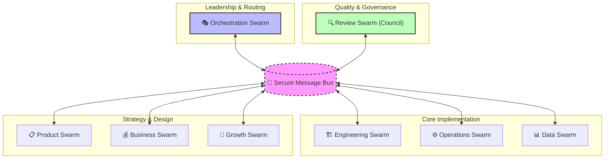

# 🌀 Sognatore Sovereign: The Definitive Swarm Engine (v3.0)

Sognatore is a high-assurance, multi-agent autonomous swarm designed for the 2026 Sovereign Agentic Computing Era. It operates as a decentralized intelligence layer composed of **42 specialized engines**, governed by the **RARV Protocol**, and protected by an isolated **Docker Sandbox** and a self-healing **Guardian**.

---

## 🏛️ Swarm Architecture (8 Functional Units)

The ecosystem achieves consensus through 8 specialized swarms communicating via a secure, file-based message bus.



---

## 📖 CLI Command Bible

| Command | Usage | Purpose |
| :--- | :--- | :--- |
| **`doctor`** | `sognatore doctor [--fix]` | **Dual-Action**: Performs Deep Diagnostics (API, Security, Sandbox) AND Autonomous Repository Cleanup. |
| **`run`** | `sognatore run [prd.md]` | Initiates the autonomous development cycle on a specification file. |
| **`setup`** | `sognatore setup` | Interactive wizard for root-level environment configuration (API Key Passport). |
| **`upgrade`** | `sognatore upgrade` | Synchronizes the core engine with the master repository. |
| **`build`** | `npm run build` | Compiles the TypeScript core into high-performance execution units. |

---

## 🔑 AI Provider Passport (Configuración)

Para que Sognatore opere a su máxima capacidad, el **EnvOracle** busca tus claves en el archivo `.env` del root:

- **Anthropic (`ANTHROPIC_API_KEY`)**: Cerebro Platino para Arquitectura y Auditoría.
- **Google Gemini (`GOOGLE_API_KEY`)**: Motor de alta velocidad para codificación masiva y análisis.
- **OpenAI (`OPENAI_API_KEY`)**: Especialista versátil para razonamiento y fallback.

Usa `sognatore setup` para configurar estas claves de forma interactiva.

---

## 🧠 The RARV & eVolt Protocols

### The Operational Heartbeat (RARV)

Every task undergoes a 4-step transformation to ensure technical excellence:

1. **REASON**: Context analysis and specialist selection.
2. **ACT**: Atomic execution and logic synthesis.
3. **REFLECT**: Self-correction and internal refinement.
4. **VERIFY**: High-assurance gate via the Quality Council.

### Autonomous Evolution (eVolt)

When encountering unknown frameworks, the swarm initiates an **Evolutionary Loop**:

1. **Gap Detection**: Identification of missing capabilities.
2. **Synthesis**: Autonomous creation of new skills in `📁 resources/skills/eVolt/`.
3. **Hydration**: Immediate activation of new powers without system restart.

---

## 👥 The Agent Collective (42 Specialists)

Sognatore manages **42 specialized agents** across 8 units. Each utilizes a tiered model strategy (Platinum, Gold, Silver) to optimize for reasoning depth and operational cost.

| Swarm | Specialist Highlights |
| :--- | :--- |
| **🛠 Engineering (8)** | `eng-frontend`, `eng-backend`, `eng-database`, `eng-mobile` |
| **⚡ Operations (8)** | `ops-devops`, `ops-security`, `ops-monitor`, `ops-incident` |
| **💼 Business (8)** | `biz-marketing`, `biz-sales`, `biz-finance`, `biz-legal` |
| **📊 Data/Product/Review (13)** | `ml-expert`, `data-eng`, `product-pm`, `review-code`, `review-sec` |
| **🧠 Orchestration (5)** | `supervisor`, `brain`, `task-master`, `orch-researcher` |

---

## 🛡️ Sovereign Security & Infrastructure

### The Guardian & EnvOracle

The **Guardian** ensures structural integrity using recursive SHA-256 validation. It decouples secrets via the **EnvOracle**, which discovers configuration files at the project root to prevent redundancy.

### Physis Docker Sandbox

All task execution occurs within an isolated, state-of-the-art Docker container:

- **Zero-Access**: Path confinement verified (cannot reach host system).
- **Multi-Runtime**: Native support for Node.js, Python 3, and Rust.

### The Self-Healing Doctor

If the system detects fragility or "ghost files" (logs/diagnostics accumulate), run:

```bash
sognatore doctor --fix
```

The system will autonomously repair configurations, download missing runtimes, and purge unnecessary temporary files.

### 🌐 Repository Credentials
