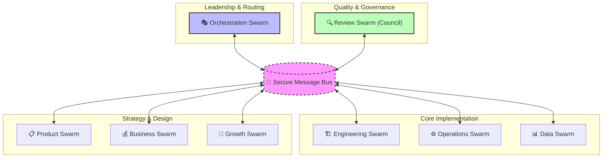
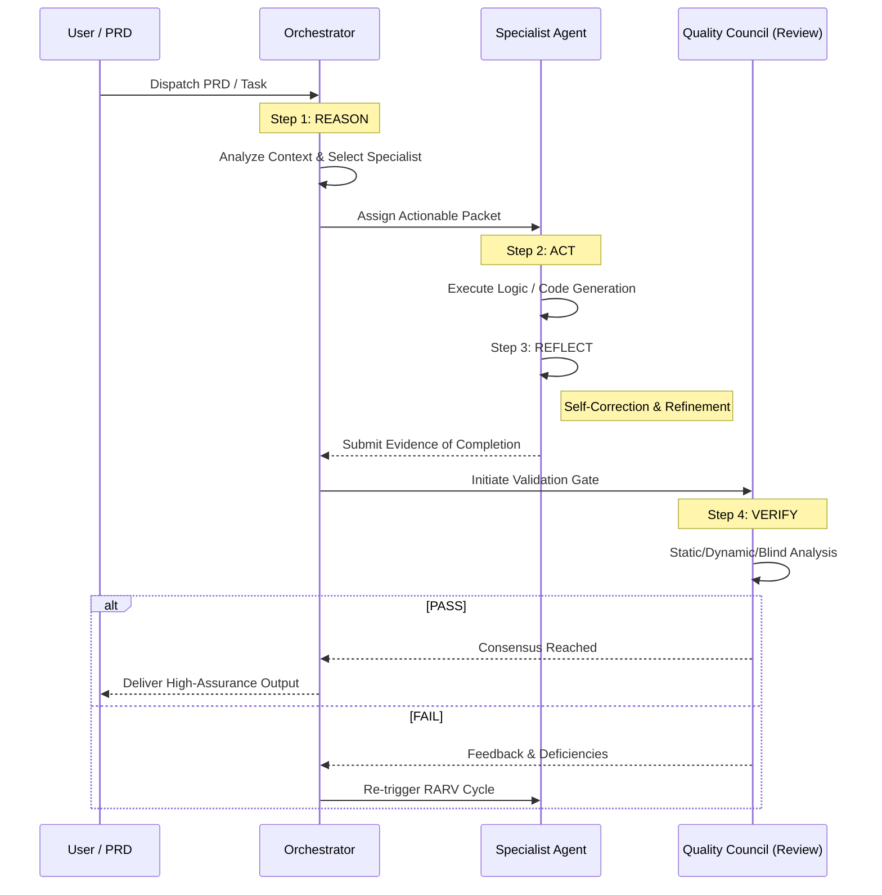

Sognatore is a high-assurance autonomous swarm ecosystem designed for the agentic computing era. It operates as a unified intelligence layer composed of **42 specialized engines** (now including the Evolutionary Brain), governed by the **RARV Protocol**, and protected by a **Sovereign Sandbox** and a **Hardened Guardian**.

---

## 🏛️ Swarm Architecture (Schematic)

The Sognatore ecosystem is organized into **8 functional swarms** that communicate via a secure, file-based message bus. This schematic represents the flow of tasks from the central Orchestrator to the specialist specialists.



---

## 🧠 The RARV Protocol (Sequence)

The **RARV Cycle** (Reason, Act, Reflect, Verify) is the operational heartbeat of Sognatore. Every task undergoes this rigorous transformation to ensure convergence and technical excellence.



### 🧬 The eVolt Pattern (Autonomous Evolution)
When a task type is encountered that is not in the current skill library, Sognatore triggers an **Evolutionary Loop**:
1. **Gap Detection**: The Orchestrator identifies missing technical capabilities.
2. **Research**: The `orch-researcher` performs a deep-dive into documentation and frameworks.
3. **Synthesis**: A new skill module is autonomously written to `📁 resources/skills/eVolt/`.
4. **Hydration**: The `SkillRegistry` performs a recursive re-load, instantly granting the swarm new powers.

---

## 📋 The 41-Agent Catalog

Sognatore manages **41 specialized agents** categorized into 8 functional areas. Each agent utilizes a specific model tier (Platinum, Gold, Silver) to balance performance and cost.

| Swarm | Agents Count | Primary Focus | Key Specialists |
| :--- | :--- | :--- | :--- |
| **Engineering** | 8 | Implementation | `frontend`, `backend`, `database`, `infra` |
| **Operations** | 8 | Deployment & Sec | `devops`, `security`, `sre`, `incident` |
| **Business** | 8 | Alignment | `finance`, `legal`, `marketing`, `hr` |
| **Growth** | 4 | Scale | `hacker`, `community`, `success`, `lifecycle` |
| **Data** | 3 | Intelligence | `ml`, `eng`, `analytics` |
| **Product** | 3 | Specs | `pm`, `design`, `techwriter` |
| **Review** | 3 | Quality | `code`, `business`, `security` |
| **Orchestration** | 5 | Management | `supervisor`, `brain`, `orch-researcher` |

---

## 💸 Economía de Enjambre 2.0 (Tiered Strategy)

To ensure maximum ROIs, Sognatore employs a intelligent tiered model strategy:

1. **💎 Platinum (Razonamiento Crítico)**:
    - **Usage**: Architecture, Security Audits, Final Gates.
    - **Models**: Claude 4.6 Opus, GPT-5.4-o.
2. **🥇 Gold (Desarrollo Estándar)**:
    - **Usage**: General coding, complex debugging, data engineering.
    - **Models**: Claude 4.6 Sonnet, Gemini 3.1 Pro.
3. **🥈 Silver (Eficiencia Masiva)**:
    - **Usage**: Documentation, logs, unit testing, repetitive tasks.
    - **Models**: Gemini 1.5 Flash, Claude 4.6 Haiku.

---

## 🛠️ Operational Command Reference

### 🏥 System Doctor

Verify environment prerequisites and AI provider integrations.

```bash
node dist/bin/sognatore.js doctor
```

### 🚀 Autonomous Execution

Launch the swarm on a PRD or Task file.

```bash
node dist/bin/sognatore.js run prd.md --stress-test
```

### 🏗️ Build & Purify

Re-compile the core system logic.

```bash
npm run build
```

---

## 📁 System Core Assets

- `📁 resources/config/`: Swarm definitions and 41-agent catalog.
- `📁 resources/skills/`: Knowledge base (17+ specialized skill modules).
- `📁 .sognatore/`: Active session state, message bus, and task queues.

---

### 🛡️ Sovereign Security Core
- **Docker Isolation**: All task execution occurs within a hardened Ubuntu container (Node/Python/Rust).
- **Guardian Integrity**: Recursive SHA-256 validation detects any tampering of core swarm files.
- **Secret Decoupling**: Configuration is externalized to `.env` with mandatory key strength validation.

> [!IMPORTANT]
> **Sovereign Autonomy**: Sognatore is built to be a resilient, self-healing system. In case of loop stagnation, the **Crisis Responder** (Operations Swarm) will automatically take control, or the **Orchestration Researcher** will expand the swarm's knowledge to overcome technical barriers.

---

Developed for the 2026 Sovereign Agentic Computing Era
