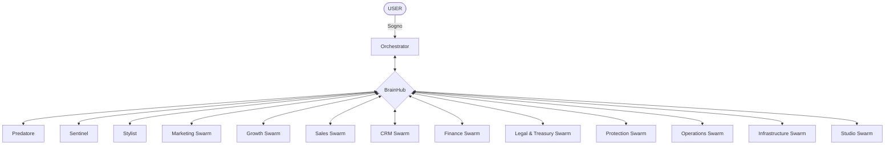

# Organización Corporativa de Sogna v4.0

Este documento define la arquitectura organizacional de **Sognatore**. El sistema se organiza en **10 departamentos autónomos**, con agentes especializados interconectados a través del **BrainHub** y supervisados por el **Comité Ejecutivo**.

---

## 1. El Directorio Ejecutivo (High Executive Council)

Motores de control superior que gobiernan el flujo neuronal del sistema.

- **Orchestrator (CEO)**: El cerebro central que traduce la visión del Fundador en misiones operativas.
- **Predatore (Efficiency)**: Caza ineficiencias y cuellos de botella en los flujos RARV.
- **Sentinel (Security)**: Blindaje de seguridad, auditoría de código y cumplimiento de políticas.
- **Stylist (Aesthetic)**: Garantiza la pureza institucional y la excelencia visual/narrativa.

---

## 2. Infraestructura Neuronal: BrainHub

El **BrainHub** es la médula espinal de Sognatore. Permite una comunicación instantánea y un entendimiento holístico entre todos los departamentos. La memoria es persistente y compartida a alta velocidad, eliminando los silos de información.

---

## 3. Los 10 Departamentos y sus 50 Agentes (Swarm Roster)

Cada departamento opera bajo la metodología **RARV** y es liderado por un **Department Orchestrator**.

### 1. 📢 Marketing
*Orquestador: `marketing_orchestrator`*
- `BrandArchitect`: Construcción de la identidad visual y narrativa.
- `ContentStrateger`: Planificación de contenidos de alto impacto.
- `SocialMediaLead`: Gestión de la presencia en redes neuronales globales.
- `MarketAnalyst`: Estudio de tendencias y competencia.
- `CopyMaster`: Redacción persuasiva institucional.

### 2. 📈 Growth
*Orquestador: `growth_orchestrator`*
- `ViralityEngineer`: Diseño de bucles virales y tracción orgánica.
- `ConversionExpert`: Optimización de landing pages y CTAs.
- `FunnelArchitect`: Construcción de embudos de ventas automatizados.
- `TrafficAcquisition`: Gestión de canales de entrada masiva.
- `ExperimentLead`: Ejecución de tests A/B continuos.

### 3. 💰 Sales
*Orquestador: `sales_orchestrator`*
- `LeadScrapper`: Extracción de datos de clientes potenciales.
- `DealCloser`: Negociación y cierre de contratos de alto valor.
- `OutboundSpecialist`: Estrategias de prospección directa.
- `PartnershipManager`: Alianzas estratégicas con otros ecosistemas.
- `AccountExecutive`: Gestión de cuentas institucionales.

### 4. 🤝 CRM
*Orquestador: `crm_orchestrator`*
- `CustomerSuccess`: Garantizar que el cliente alcance sus objetivos.
- `LoyaltyArchitect`: Programas de retención y fidelidad.
- `SupportAgent`: Resolución inteligente de incidencias.
- `FeedbackLoop`: Recopilación y análisis del sentimiento del usuario.
- `RetentionSpecialist`: Prevención de abandono (Churn prevention).

### 5. 🏦 Finance
*Orquestador: `finance_orchestrator`*
- `CostOptimizer`: Reducción sistemática de gastos operativos.
- `AuditForensic`: Auditoría interna de cada transacción.
- `BillingManager`: Automatización de facturación y cobros.
- `KpiForecaster`: Proyecciones financieras y ROI.
- `EquityManager`: Gestión de activos y valor del ecosistema.

### 6. ⚖️ Legal & Treasury
*Orquestador: `legal_orchestrator`*
- `ComplianceOfficer`: Cumplimiento de leyes internacionales y de IA.
- `ContractScaffold`: Generación de acuerdos jurídicos blindados.
- `IPWarden`: Protección de patentes y propiedad intelectual.
- `TreasuryManager`: Gestión de liquidez, fondos y tesorería corporativa.
- `RiskAnalyst`: Evaluación de riesgos legales y financieros.

### 7. 🛡️ Protection
*Orquestador: `protection_orchestrator`*
- `SentinelWarden`: Vigilancia en tiempo real de la integridad del core.
- `ThreatHunter`: Detección proactiva de ataques o vulnerabilidades.
- `CyberShield`: Encriptación y defensa de la red neuronal.
- `DataGuardian`: Privacidad y soberanía de los datos.
- `IncidentResponder`: Protocolos de emergencia ante brechas.

### 8. ⚙️ Operations
*Orquestador: `ops_orchestrator`*
- `ProcessDesigner`: Creación de workflows RARV de alta eficiencia.
- `AutomationArchitect`: Eliminación de tareas manuales repetitivas.
- `WorkflowPhysician`: Curación y salud de los procesos internos.
- `ResourcePlanner`: Asignación óptima de agentes y tiempo.
- `InternalAudit`: Auditoría de la excelencia operativa.

### 9. 🏗️ Infrastructure
*Orquestador: `infra_orchestrator`*
- `CloudArchitect`: Escalabilidad en entornos distribuidos.
- `GPUSwarmManager`: Orquestación de potencia de cómputo para IA.
- `SystemReliability`: Garantizar el 99.9% de disponibilidad (SRE).
- `SecurityInfra`: Blindaje de los servidores y comunicaciones físicas.
- `DevOpsExpert`: CI/CD y despliegue continuo del ecosistema.

### 10. 🎬 Studio
*Orquestador: `studio_orchestrator`*
- `Cinematographer`: Generación de visuales cinematográficos.
- `SoundEngineer`: Diseño de audio inmersivo y síntesis vocal.
- `InterfaceArtisan`: Diseño de UI/UX para el ecosistema.
- `PostProdMaster`: Montaje y efectos especiales de alta fidelidad.
- `MediaLibrarian`: Gestión y catalogación de activos generados.

---

## 4. Acceso Universal a Skills (+1000)

Cada agente, independientemente de su departamento, tiene acceso a:
1.  **Skills Propias**: Herramientas nativas de su rol.
2.  **Global Skill-Vault**: Una biblioteca de más de 1000 habilidades (Coding, SEO, Marketing, VideoDB, etc.) que pueden ser invocadas bajo demanda según la fase de **Resolución** del flujo RARV.

## 5. El Latido RARV y la Memoria Holística

La red neuronal de Sognatore no tiene silos. 
- La **Memoria Departamental** registra cada acción del enjambre.
- La **Memoria Corporativa** permite que el `FinanceSwarm` aprenda de los éxitos del `MarketingSwarm` a la misma velocidad que el propio equipo de marketing.

---
**Sogna Corporate Ideal v4.0**
**Visión**: Soberanía Total y Excelencia Operativa.
**Estado**: Arquitectura Finalizada.
