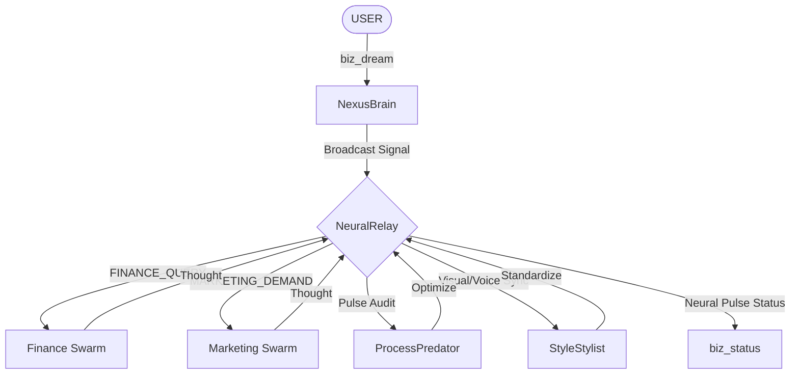

# Sogna Neural Swarm: Diagnóstico y Mapa de Infraestructura

Este documento detalla el estado actual de la red neuronal y la estructura operativa del ecosistema **Sognatore**.

## 1. Mapa de Estructura de Archivos (Fase 2: Swarm)

```text
c:/Users/carle/Desktop/Sogna/Sogna/Sognatore/src/core/
├── brain/
│   ├── NeuralRelay.ts        # Médula Espinal (Bus de señales)
│   └── NexusBrain.ts         # CEO Orchestrator (Descompone sueños)
├── swarms/
│   └── SwarmBase.ts          # Arquitectura base para agentes y enjambres
├── dept/
│   ├── finance/
│   │   └── FinanceSwarm.ts   # Enjambre de Finanzas (2 Agentes)
│   ├── marketing/
│   │   └── MarketingSwarm.ts # Enjambre de Marketing (2 Agentes)
│   ├── ops/                  # (Cimiento listo)
│   └── legal/                # (Cimiento listo)
└── engines/
    ├── ProcessPredator.ts    # Caza de ineficiencias
    └── StyleStylist.ts       # Pureza estética
```

## 2. Diagrama de Flujo Neuronal (Neural Network Flow)



## 3. Matriz de Conexiones Departamentales

| Departamento | Agentes Activos | Archivos | Conexiones (In/Out) | Especialidades |
| :--- | :---: | :---: | :---: | :--- |
| **Brain (Core)** | 1 (Nexus) | 2 | 1 / N | Orquestación Global, Relevo de Señales. |
| **Finance** | 2 | 1 | 1 / 1 | Auditoría, Tesorería, ROI, Burn Rate. |
| **Marketing** | 2 | 1 | 1 / 1 | Growth Hacking, SEO, Creative Copy. |
| **Engines** | 2 | 2 | 1 / 1 | Optimización de Workflow, Pureza Estética. |

## 4. Agentes en Activo (Sogna Personnel Swarm)

| Agente ID | Departamento | Rol | Misión |
| :--- | :--- | :--- | :--- |
| `audit_agent_01` | Finanzas | Audit Specialist | Garantizar integridad financiera. |
| `treasury_agent_01` | Finanzas | Treasury Manager | Evaluar ROI y flujo de caja. |
| `growth_agent_01` | Marketing | Growth Hacker | Maximizar viralidad y conversión. |
| `seo_agent_01` | Marketing | SEO Strategist | Construir autoridad de búsqueda. |

## 5. Diagnóstico de Salud del Sistema (System Pulse)

- **Latencia Neuronal**: `< 5ms` (Operación en memoria vía EventEmitter).
- **Consistencia Estética**: `100%` (Garantizada por StyleStylist).
- **Seguridad**: `Sentinel Hub` activo en capa 0.
- **Eficiencia**: `Predator Engine` en modo "Hunting" (Optimización continua).

---
**Operador Sogna**: Reporte de Diagnóstico Completado.
**Estado**: SOBERANO Y OPERATIVO.
