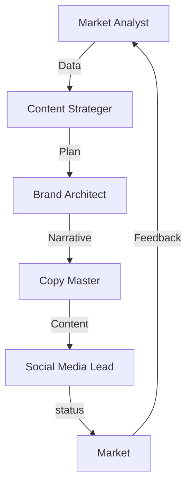

# Mapa system: Departamento de Marketing (The Cathedral)

## 1. Conexiones Internas (Cycle Flow)

## 2. Conexiones Externas (processorHub)

- **Signal: `MARKETING_DEMAND`** -> Inicia `ProductLaunchWorkflow`.
- **Signal: `BUDGET_UPDATE`** -> Recibida desde **Finance Hub**.
- **Signal: `LEGAL_REVIEW_REQ`** -> Enviada a **Legal & Compliance**.

## 3. Integración con el Vault (+1000 Skills)

Cada agente consulta el `MarketingSkillRegistry` para determinar qué herramienta externa utilizar:

- **Analyst**: `deep-research`, `competitor-alternatives`.
- **Architect**: `brand-guidelines`, `design-spells`.
- **Copy**: `copywriting-psychologist`, `ux-copy`.
