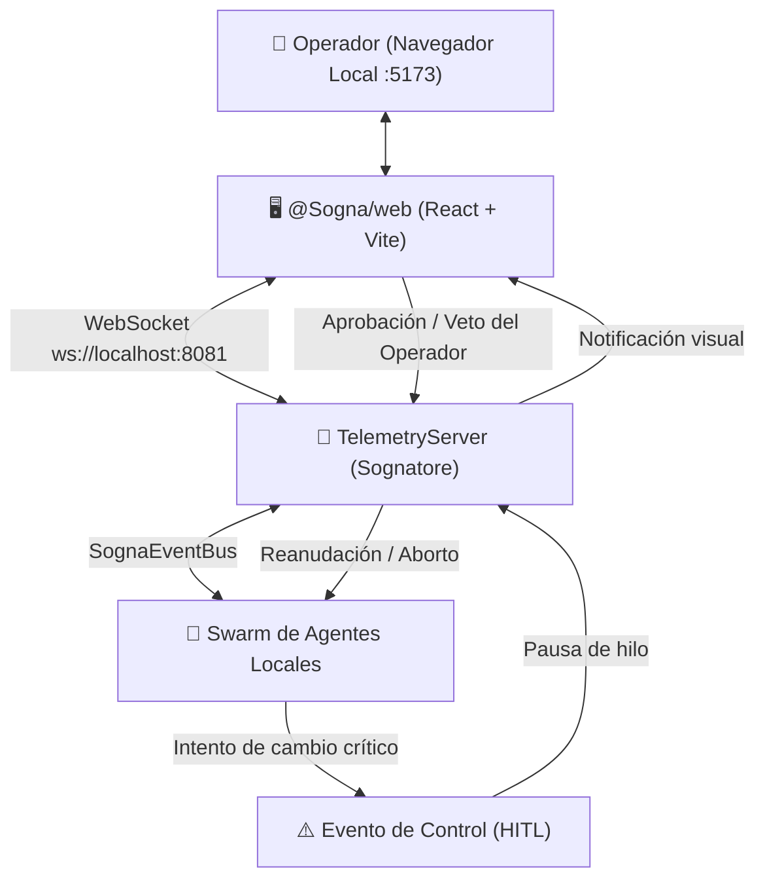

# 🌀 SOGNA: BLUEPRINT DE DESARROLLO Y CAPACIDADES LOCALES
> **Estrategia Técnica de Optimización Local y Plan de Integración de Sistemas**

---

## 🏛️ Resumen Ejecutivo

El ecosistema Sogna está diseñado como un motor de desarrollo autónomo multi-agente enfocado en la ejecución local de alta fiabilidad. Sus componentes principales—el núcleo de orquestación **Sognatore**, el catálogo de habilidades y reglas en **Curator**, y la **Arquitectura de Memoria Unificada (UMA)**—proveen una base operativa sólida para la automatización de procesos de software complejos.

Para maximizar el valor del sistema en el entorno de desarrollo local del **Operador**, esta propuesta redefine los cuatro pilares clave de optimización (Seguridad, Interfaz, FinOps y Registro de Habilidades) para su despliegue inmediato en local, utilizando las mejores herramientas y metodologías disponibles en la arquitectura monopuesto.

---

## 🔍 Auditoría de Capacidades: Estado Actual vs. Optimización Local

El análisis de la infraestructura local de Sogna revela oportunidades críticas para consolidar el sistema antes de planificar cualquier transición de red o escalabilidad distribuida:

| Pilar Operativo | Estado Local Actual | Objetivo de Optimización Local | Acción Técnica en el Monorepo |
| :--- | :--- | :--- | :--- |
| **Seguridad e Integridad (Pilar 2)** | Archivos en texto plano, control de comandos estático por Sentinel. | Sanitización activa de llamadas externas, firmas criptográficas de logs locales y sandboxing rígido. | Desarrollar un proxy local de prompts en el módulo de red y un validador de integridad HMAC para logs de auditoría. |
| **Interfaz y Visualización (Pilar 3)** | Dashboard HTML estático en :8001 y portal React en desarrollo. | Consola de control unificada con Monaco editor, visualizador de grafos interactivos y HITL local. | Integrar el arranque de `@Sogna/web` en el script `Sogna.bat` y enlazar la aprobación manual vía WebSockets. |
| **Gobernanza Financiera (Pilar 4)** | Registro de tokens básico en `Treasurer.ts` sin límites reactivos. | Enrutamiento inteligente a modelos locales/externos y corte preventivo (System Panic) en local. | Configurar el enrutamiento de tareas sencillas hacia modelos de Ollama locales y habilitar el presupuesto reactivo. |
| **Catálogo de Habilidades (Pilar 5)** | Archivos de habilidades distribuidos en carpetas de Curator. | Carga, indexación y validación dinámica de habilidades locales en tiempo de ejecución. | Desarrollar un cargador reflexivo de habilidades capaz de verificar la sintaxis de las interfaces de agentes en caliente. |

---

## 🧬 Pilares de Optimización en Entorno Local

### 1. Blindaje de Seguridad y Trazabilidad Local (SecOps)
La protección de la propiedad intelectual y el aislamiento de la ejecución son críticos, incluso en una instalación monopuesto.

*   **Pasarela de Sanitización Local para Prompts**: Desarrollar un middleware de red en `Sognatore/src/Sentinel-Sognatore/Shield.ts` que intercepte todas las peticiones salientes dirigidas a proveedores externos de IA. Este componente analizará los payloads en tiempo real, redactando de forma automática cualquier secreto expuesto, variable de entorno crítica, credenciales locales o rutas absolutas del disco del Operador (`C:\Users\carle\...`) mediante marcadores anónimos antes de la transmisión de red.
*   **Trazabilidad Forense Local**: Implementar un registro de auditoría inmutable en `memory/operational/logs/audit.json`. Cada comando ejecutado y cada archivo modificado por los agentes se registrará con un hash SHA-256 firmado con una clave efímera local generada en el arranque del sistema (`Pulse`). `Sentinel` verificará la integridad de la cadena al iniciar cada misión.
*   **Sandboxing Rígido en Disco**: Restringir el alcance físico de las acciones de los agentes a directorios autorizados en el archivo de gobernanza `.sognarc.json`. El módulo `PermissionProxy.ts` vetará proactivamente cualquier intento de lectura o escritura que apunte a rutas fuera del espacio de trabajo de Sogna.

---

### 2. Consola de Control Colaborativo e Interfaz Local (UI/UX)
Sustituir la ejecución en CLI por un panel de control interactivo local de alto rendimiento que sitúe al Operador en el centro de las decisiones del sistema.

#### Módulos Clave a Consolidar en Local:
*   **Automatización de Lanzamiento**: Modificar el panel de control de `control/Sogna.bat` para iniciar en segundo plano el servidor de desarrollo de `@Sogna/web` (`vite` en puerto `5173`) junto con el servidor de telemetría de WebSockets (`TelemetryServer.ts` en puerto `8081`).
*   **Visualizador Dinámico del Grafo (UMA)**: Implementar en `SemanticGraphView.tsx` un visualizador interactivo 2D utilizando la biblioteca D3.js. Este componente consumirá el archivo `memory/intelligence/semantic/graph.json` para permitir al Operador examinar los nodos de conocimiento y sus relaciones conceptuales.
*   **Editor Monaco con Visor de Diffs**: Integrar el editor Monaco de Microsoft en `CortexEditor.tsx` para mostrar comparativas visuales estilo Git (diffs) de las modificaciones de código sugeridas por los agentes de ingeniería, facilitando la revisión del Operador.
*   **Puerta de Aprobación Manual (HITL)**: Implementar el flujo completo de pausa reactiva en local. Cuando un agente intente realizar una acción de alta criticidad (ej. ejecutar comandos de consola fuera del sandbox o modificar archivos protegidos de gobernanza), el bus de eventos local suspenderá el hilo de ejecución del agente y enviará un evento de veto temporal al WebSocket. La interfaz de `@Sogna/web` desplegará un modal visual para que el Operador apruebe o deniegue la acción.

---

### 3. FinOps Dinámico: Control de Tokens y Costes en Local
Prevenir la deriva financiera y optimizar el consumo de tokens en tareas locales redundantes.

*   **Enrutamiento Inteligente de Modelos**: Adaptar el orquestador (`Orchestrator.ts`) para soportar un esquema de enrutamiento híbrido local/nube. Las tareas de baja complejidad (formateo de código, generación de comentarios, auditorías de logs sencillas) se redirigirán a instancias locales de Ollama que ejecuten modelos compactos y eficientes (como `deepseek-coder:6.7b` o `qwen2.5-coder:7b`). Las tareas que requieran síntesis conceptual profunda o codificación compleja se enrutarán a modelos externos avanzados.
*   **Límites de Misión Reactivos**: Extender el módulo `Treasurer.ts` para leer límites diarios y por ejecución directamente desde `.sognarc.json`. Si el número acumulado de tokens consumidos por una misión local supera el umbral establecido o se detecta un bucle de prompts anómalo (Wallet DoS), el `Treasurer` activará de forma autónoma una interrupción crítica del sistema (System Panic), deteniendo todos los procesos de los agentes locales para evitar cargos imprevistos.

---

### 4. Registro y Validación de Habilidades (Curator Skills)
Consolidar el ecosistema de habilidades en local como una biblioteca modular extensible de alta fiabilidad.

*   **Validador Estricto de Habilidades**: Diseñar un script de verificación en `Curator/scripts/skill_validator.js` que verifique la conformidad sintáctica de cada habilidad registrada en `Curator/skills`. Debe validar que cada habilidad posea un archivo `SKILL.md` con firmas e interfaces de entrada/salida estrictamente tipadas antes de permitir su carga en el swarm.
*   **Carga Dinámica Reflexiva**: Modificar el motor de ejecución en `Sognatore` para posibilitar la recarga de habilidades en caliente. Mediante la inspección del Knowledge Graph de UMA, los agentes podrán detectar e integrar nuevas habilidades de desarrollo locales añadidas al directorio `Curator/skills` en tiempo de ejecución, eliminando la necesidad de reiniciar los servidores residentes o el panel de control local.

---

## 🗺️ Plan de Acción Local (Próximas Sesiones)

Para materializar estas capacidades en local de forma secuencial y estructurada, se propone el siguiente cronograma de desarrollo en el espacio de trabajo:

*   **Fase A: Interfaz Unificada e HITL Local (Días 1 - 5)**:
    *   Integración de `@Sogna/web` en la secuencia de arranque de `control/Sogna.bat`.
    *   Despliegue del canal de confirmación HITL en el WebSocket de `TelemetryServer.ts` y en el modal interactivo de la UI React.
*   **Fase B: Pasarela de Seguridad y Firmas (Días 6 - 10)**:
    *   Despliegue del interceptor de PII y secretos en `Shield.ts`.
    *   Generación y firma criptográfica HMAC local para el registro `audit.json`.
*   **Fase C: FinOps Híbrido y Enrutamiento Local (Días 11 - 15)**:
    *   Integración de llamadas locales a Ollama en el motor de inferencia de `Sognatore`.
    *   Pruebas de presupuesto reactivo y corte por pánico de tokens en `Treasurer.ts`.
*   **Fase D: Validación Dinámica de Curator Skills (Días 16 - 20)**:
    *   Creación del suite de test estáticos de habilidades locales en `Curator/scripts`.
    *   Implementación de la hidratación y recarga en caliente de habilidades.
