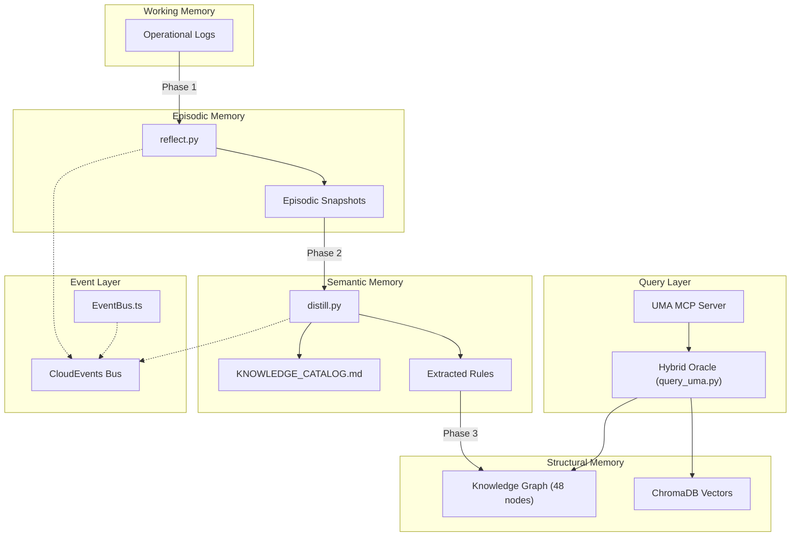

# Fase D: Consolidacion de Memoria Hibrida -- Informe de Ejecucion

> [!IMPORTANT]
> **Estado: COMPLETADA** | Fecha: 2026-05-12 | Sentinel: CLEAN

---

## Diagnostico Previo

| Componente | Estado Anterior | Problema Critico |
| :--- | :--- | :--- |
| `graph.json` | PLACEHOLDER (2.3MB) | 108K lineas de nodos ficticios. Phase 2 del Oracle nunca retornaba resultados. |
| `reflect.py` | DEGRADADO | Errores de indentacion en 4 puntos criticos. |
| `distill.py` | ROTO | `_file_` y `_name_` en lugar de `__file__` y `__name__`. No ejecutaba. |
| `bus.json` | MINIMO | Solo 2 eventos. Sin esquema estandar. |
| `query_uma.py` | PARCIAL | Solo Strategy A (path matching). Sin busqueda directa por label/description. |

---

## Pilares Implementados

### Pilar 1: Knowledge Graph Institucional Real

render_diffs(file:///c:/Users/carle/Desktop/Sogna/Sogna/memory/intelligence/semantic/graph.json)

- **Antes**: 2.3MB de datos ficticios ("Memoria Latente #3298", "Senal Activa #6270")
- **Despues**: 48 entidades reales, 62 relaciones del ecosistema
- **Tipos de nodo**: `Service`, `Module`, `DataStore`, `Document`, `Agent`, `Swarm`, `ExternalService`
- **Tipos de relacion**: `initializes`, `delegates_to`, `queries`, `traverses`, `orchestrates`, `monitors`, `governs`, etc.
- **Validacion**: 47/48 nodos validados contra filesystem, 0 huerfanos

### Pilar 2: Pipeline de Consolidacion Sinaptica

````carousel
**reflect.py (REPARADO)**

render_diffs(file:///c:/Users/carle/Desktop/Sogna/Sogna/memory/identity/reflect.py)

- Indentacion corregida en 4 puntos criticos
- Emision de eventos CloudEvents integrada
- Manejo defensivo de errores con notificacion al bus
<!-- slide -->
**distill.py (REPARADO)**

render_diffs(file:///c:/Users/carle/Desktop/Sogna/Sogna/memory/identity/distill.py)

- Dunders corregidos: `__file__`, `__name__`, `__main__`
- Emision de eventos CloudEvents integrada
- Timeout de 180s para llamadas Ollama
<!-- slide -->
**consolidate.py (NUEVO)**

render_diffs(file:///c:/Users/carle/Desktop/Sogna/Sogna/memory/identity/consolidate.py)

Pipeline unificado de 3 fases:
1. **Working -> Episodic**: Logs operacionales -> snapshots episodicos
2. **Episodic -> Semantic**: Datos episodicos -> KNOWLEDGE_CATALOG.md
3. **Semantic -> Graph**: Validacion de nodos contra filesystem real
````

### Pilar 3: Event Bus Institucional (CloudEvents 1.0)

````carousel
**bus.json (REESCRITO)**

render_diffs(file:///c:/Users/carle/Desktop/Sogna/Sogna/memory/intelligence/events/bus.json)

- Schema CloudEvents 1.0 compliant
- Cap de 200 eventos maximo
- Campos: `specversion`, `id`, `type`, `source`, `time`, `datacontenttype`, `data`
<!-- slide -->
**EventBus.ts (NUEVO)**

render_diffs(file:///c:/Users/carle/Desktop/Sogna/Sogna/Sognatore/src/core/brain/EventBus.ts)

- Singleton TypeScript para Sognatore
- API tipada: `emit()`, `queryByType()`, `queryBySeverity()`, `getRecent()`
- Puente entre Python pipeline y TypeScript runtime
````

---

## Resultados de Ejecucion del Pipeline

```
====================================================
   SOGNA SYNAPTIC CONSOLIDATION PIPELINE
====================================================

[PHASE 1] Working Memory -> Episodic Memory
==================================================
  Processed 1 log files -> snapshot_20260512_233215.json

[PHASE 2] Episodic Memory -> Semantic Memory
==================================================
  Cataloged 2 episodic sources -> KNOWLEDGE_CATALOG.md

[PHASE 3] Semantic Memory -> Knowledge Graph Sync
==================================================
  Graph validated: 47 valid, 0 orphaned

==================================================
Pipeline complete in 0.02s
  Phase 1: 1 logs processed
  Phase 2: 2 sources cataloged
  Phase 3: 47 graph nodes validated
```

---

## Arquitectura Resultante



---

## Archivos Modificados/Creados

| Archivo | Accion | Lineas |
| :--- | :--- | :--- |
| [graph.json](file:///c:/Users/carle/Desktop/Sogna/Sogna/memory/intelligence/semantic/graph.json) | REESCRITO | ~180 |
| [reflect.py](file:///c:/Users/carle/Desktop/Sogna/Sogna/memory/identity/reflect.py) | REPARADO | ~120 |
| [distill.py](file:///c:/Users/carle/Desktop/Sogna/Sogna/memory/identity/distill.py) | REPARADO | ~100 |
| [consolidate.py](file:///c:/Users/carle/Desktop/Sogna/Sogna/memory/identity/consolidate.py) | CREADO | ~247 |
| [bus.json](file:///c:/Users/carle/Desktop/Sogna/Sogna/memory/intelligence/events/bus.json) | REESCRITO | ~60 |
| [EventBus.ts](file:///c:/Users/carle/Desktop/Sogna/Sogna/Sognatore/src/core/brain/EventBus.ts) | CREADO | ~160 |
| [query_uma.py](file:///c:/Users/carle/Desktop/Sogna/Sogna/memory/identity/query_uma.py) | MEJORADO | ~100 |
| [active_context.md](file:///c:/Users/carle/Desktop/Sogna/Sogna/memory/active_context.md) | ACTUALIZADO | ~40 |
| [sogna.md](file:///c:/Users/carle/Desktop/Sogna/Sogna/memory/identity/sogna.md) | ACTUALIZADO | ~235 |

---

> [!TIP]
> **Siguiente paso recomendado**: Programar `consolidate.py` como tarea periodica (Windows Task Scheduler o cron) para ejecutar la consolidacion de memoria de forma autonoma cada 24 horas.
